+ ## JPA
    + ### 구동 방식
        1. Build 파일을 통해서 JPA 인터페이스를 구현할 구현체 클래스인 Persistence를 생성
        2. 생성한 Persistence로 META-INF/Persistence.xml라는 설정파일 정보를 읽은 후 EntityManagerFactory를 생성
        3. 생성한 EntityManagerFactory로 EntityManager를 생성해서 DB 접근
    + ### Entity
        + EntityManagerFactory
            + EntityManager를 만들기 위해 필요한 class
            + 만들 때 비용이 많이들어서 미리 Bean으로 등록해 놓은 후 공유
        + EntityManager
            + EntityManagerFactory를 통해서 요청이 올 때마다 생성
            + EntityManager를 통해서 DB에 접근 및 CRUD 실행
    + ### 영속성 컨텍스트
        + 뜻 : "Entity를 영구 저장하는 환경"
        + DB에 바로 저장하는게 아닌 EntityManager를 통해서 영속성 컨텍스트에 저장해놓는다.
        + 이점
            + 1차 캐시
            + 동일성 보장
            + 트랜잭션을 지원하는 쓰기 지연
            + 변경 감지(Dirty Checking)
            + 지연 로딩(Lazy Loading)
        + 생명주기
            + 비영속 (new/transient)
                + 영속성 컨텍스트와 전혀 관계가 없는 새로운 상태
                + 예) 새로운 Entity 기본 생성자 생성
            + 영속 (maaged)
                + 영속성 컨텍스트에 관리되는 상태
                + 예) entityManager.persist(entity)
            + 준영속 (detached)
                + 영속성 컨텍스트에 저장되었다가 분리된 상태
                + 예) entityManager.detach(entity)
            + 삭제 (removed)
                + 삭제된 상태
                + 예) entityManager.remove(entity)
    + ### 필드와 컬럼 매핑
        + @Id : 기본키(PK) 매핑
        + @Column : 컬럼 매핑
            + name : 컬럼명 직접 매핑 가능
        + @Enumerrated : EnumType 매핑
            + EnumType.ORDINAL : enum 순서를 DB에 저장, default
            + EnumType.STRING : enum 이름을 DB에 저장
        + @Temporal : sql의 DateType 매핑
            + LocalDate, LocalDateTime : Java8 부터 매핑 가능
    + ### 연관관계 매핑
      + 설명 :
        + ### 단방향 연관관계
          + 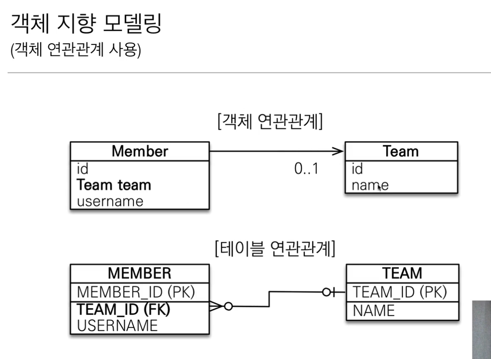
            + 설명 :
              + 방향(Direaction) : 단방향, 양방향
              + 다중성(Multiplicitiy) : 다대일(N:1), 일대다(1:N), 일대일(1:1)
              + 연관관계의 주인(Owner) : 객체 양방향 연관관계는 관리가 필요
              + 애노테이션
                + Multi Entity 매핑 기준 (ManyToOneMember.class)
                  + @ManyToOne : 다대일 매핑 사용
                  + @JoinColumn : 매핑 할 컬럼 정의
        + ### 양방향 연관관계
          + 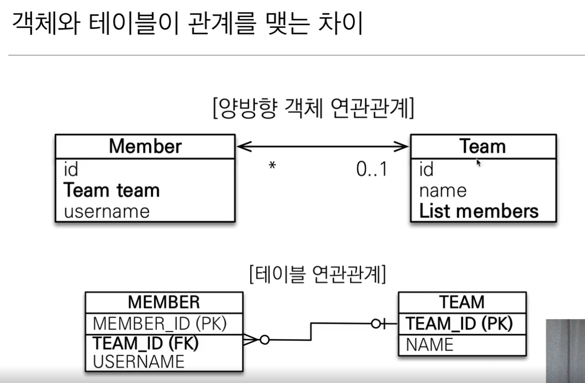
            + 객체 연관관계 = 2개
                + 회원 -> 팀 연관관계 1개(단방향)
                + 팀 -> 회원 연관관계 1개(단방향)
            + 테이블 연관관계 = 1개
                + 회원 <-> 팀 연관관계 1개 (양방향)
            + 양방향 매핑 규칙
              + 객체의 두 관계중 하나를 연관관계의 주인으로 지정
                + <U>**외래키**</U>가 있는 곳이 주인
                + 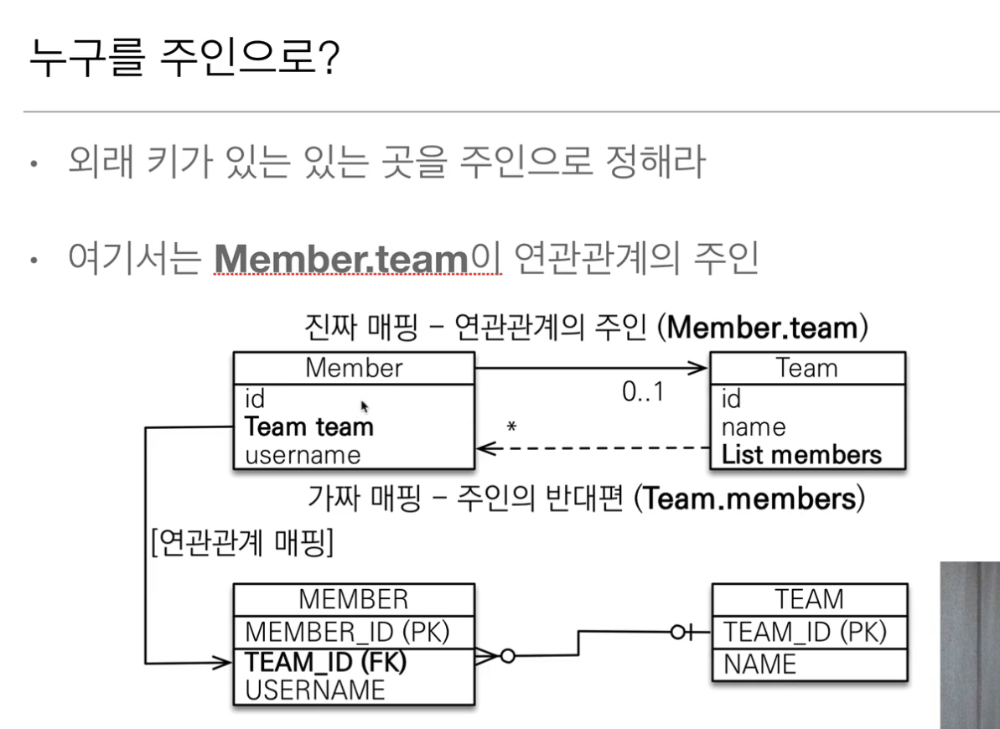
              + <U>**연관관계의 주인만이 외래 키를 관리(등록 수정)**</U>
              + <U>**주인이 아닌 쪽은 읽기만 가능**</U>
              + 주인은 mappedBy 속성 사용 X
              + 주인이 안니면 mappedBy 속성으로 주인 지정
              + 양방향 매핑시 연관관계의 주인에 값을 입략헤애 힌다.
                + <U>**mappedBy 속성으로된 필드에 값을 입력시 insert 쿼리 적용X**</U>
              + 무한루프를 조심하자
                + 예) toString(), lombok, JSON 생성 라이브러리, Controller에서 Entity 반환 금지
              + ManyToManyMember.changeManyToManyTeam() 처럼 양방향 연관관계 편의 메소드를 지정하면 편하다.
            + 설명 :
              + 객체 연관관계 : 2개
                + ManyToManyMember -> ManyToManyTeam 연관관계 1개
                + ManyToManyTeam -> ManyToManyMember 연관관계 1개
                + 애노테이션
                  + Many Entity 매핑 기준 (ManyToOneMember.class)
                    + @ManyToOne : 다대일 매핑 사용
                    + @JoinColumn : 매핑 할 컬럼 정의
                  + Many Entity 매핑 받는 기준 (ManyToManyTeam.class)
                    + @OneToMany(mappedBy = "manyToManyTeam") : 
                      + ManyToOneMember에 <U>**changeManyToManyTeam**</U> 변수로 선언된 값 mappedBy 매핑 필요
              + 테이블 연관관계 : 1개
                  + Member <-> Team 연관관계 1개
            + 정리 :
              + <U>**단방향 매핑만으로도 이미 연관관계 매핑은 완료**</U>
              + 양방향 매핑은 반대방향으로 조회(객체 그래프 탐색) 기능이 추가가된 것 뿐
              + JPQL에서 역방향으로 탐색할 일이 많음
              + 단방향 매핑을 잘 하고 양방향은 필요할 떄 추가해도 됨(테이블에 영향을 주지 않음)
      + 종류 :
        + 다대일 [N:1] : @ManyToOne     
          + 외래키가 있는곳에 참조를 걸면된다.
          + kr.co.kjc.study.jpastudy.ManyToOne 패키지 참조
            + 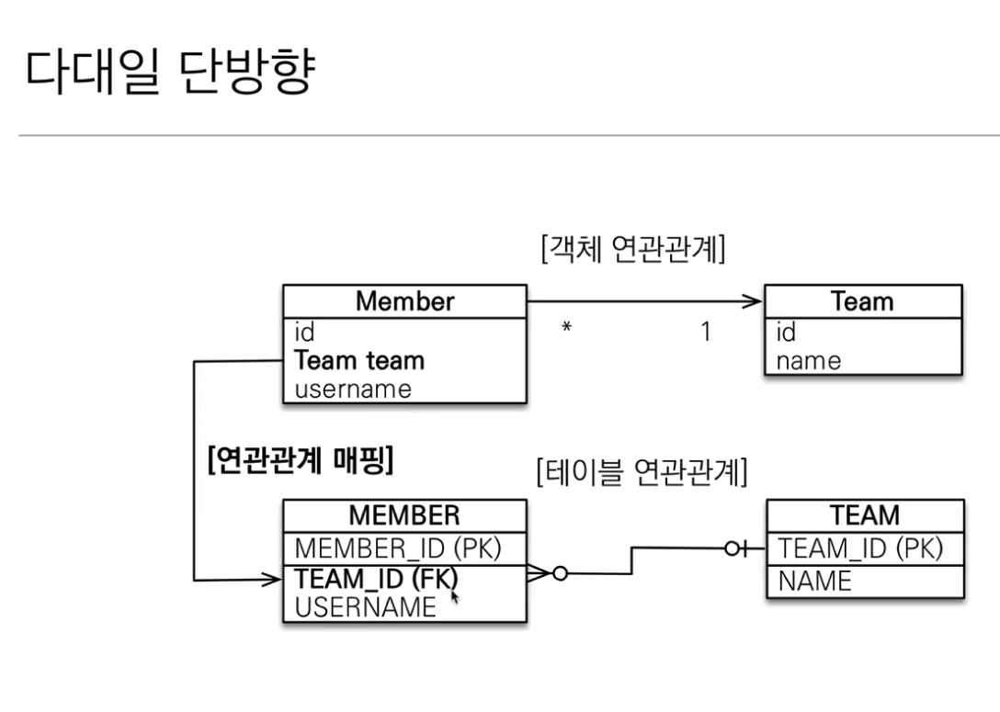
        + 일대다 [1:N] : @OneToMany     
          + 일대다 단방향은 일대다(1:N)에서 <U>**일(1)이 연관관계의 주인**</U>
          + 테이블 일대다 관계는 항상 <U>**다(N)쪽에 외래 키가 있음**</U>
          + 객체와 테이블의 차이 때문에 반대편 테이블의 외래 키를 관리하는 특이한 구조
          + @JoinColumn을 꼭 사용해야 함. 그렇지 않으면 조인 테이블 방식을 사용함(중간에 테이블을 하나 추가함)
          + 단점 : 
            + 엔티티가 관리하는 외래 키가 다른 테이블에 있음
            + <U>**연관관계 관리를 위해 추가로 UPDATE SQL 실행**</U>
            + 일대다 단방향 매핑보다는 <U>**다대일 양방향 매핑**</U>을 사용하자.
          + kr.co.kjc.study.jpastudy.OneToMany 패키지 참조
            + 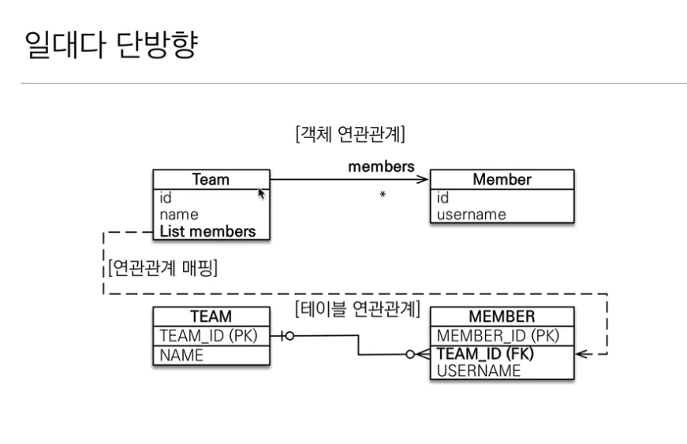
        + 일대일 [1:1] : @OneToOne     
          + 일대일 관계는 그 반대도 일대일
          + 주 테이블이나 대상 테이블 중에 외래 키 선택 가능
            + 주 테이블에 외래 키
            + 대상 테이블에 외래 키
          + 외래 키에 데이터베이스 유니크(UNI) 제약조건 추가
          + 정리 : 
            + 주 테이블에 외래 키
              + 주 객체가 대상 객체의 잠조를 가지는 것 처럼 주 테이블에 외래 키를 두고 대상 테이블을 찾음
              + 객체지향 개발자 선호
              + JPA 매핑 편리
              + 장점 : 주 테이블만 조회해도 대상 테이블에 데이터가 있는지 확인 가능
              + 단점 : 값이 없으면 외래키에 null 허용
            + 대상 테이블에 외래 키
              + 대상 테이블에 외래 키가 존재
              + 전통적인 데이터베이스 개발자 선호
              + 장점 : 주 테이블과 대상 테이블을 일대일에서 일대다 관계로 변경할 때 테이블 유지
              + 단점 : 프록시 기능의 한계로 <U>**지연 로딩으로 설정해도 항상 즉시 로딩 됨**</U>
          + kr.co.kjc.study.jpastudy.OneToOne 패키지 참조
            + 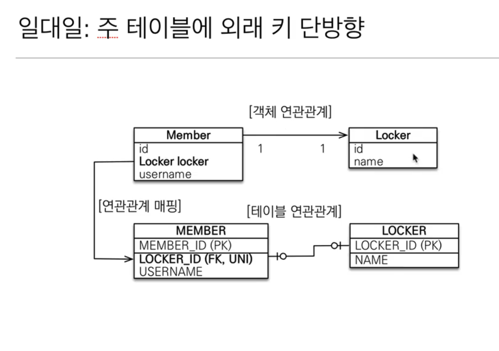
        + 다대다 [N:N] : @ManyToMany - <U>**실무에선 쓰면 안된다!**</U>
          + @JoinTable로 연결 테이블 지정 
          + kr.co.kjc.study.jpastudy.ManyToMany 패키지 참조
            + 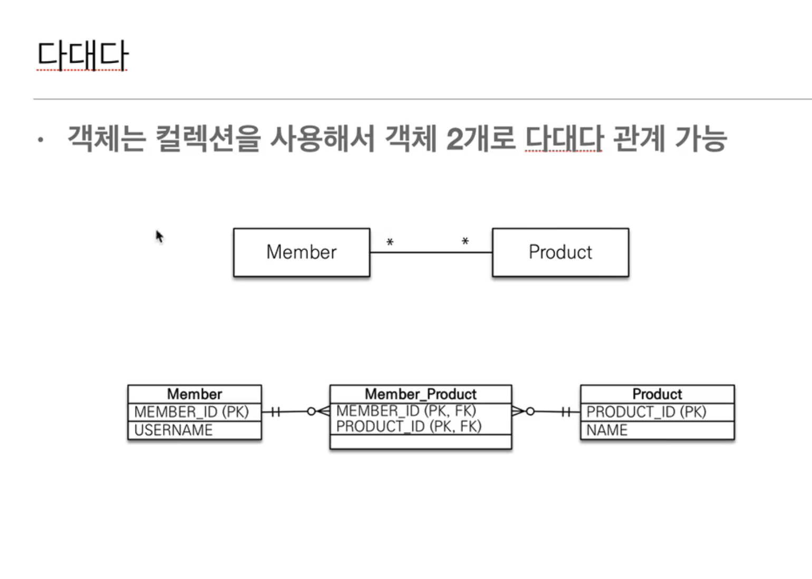
          + 다대다 매핑의 한계
            + 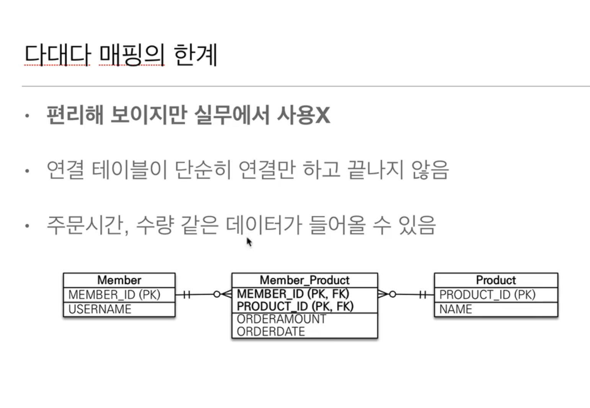
          + 다대다 매핑의 한계 극복 (ManyToManyMemberProduct.class)
            + 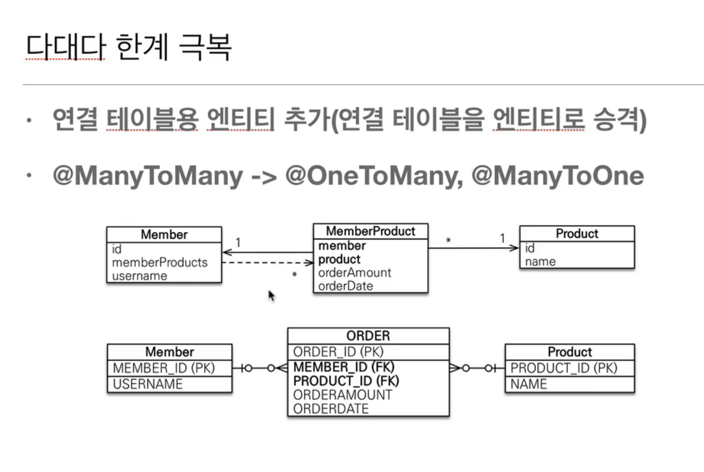

    + ### 상속관계 매핑
      + 정의 : 
        + 관계형 데이터베이스는 상속 관계X
        + 슈퍼타입 서브타입 관계라는 모델링 기법이 객체 상속과 유사
        + 객체의 상속과 구조와 DB의 슈퍼타입 서브타입 관계를 매핑
      + 애노테이션
        + @Inheritance(strategy=InheritanceType.XXX)
          + JOINED : 조인전략
          + SINGLE_TABLE : 단일 테이블 전략
          + TABLE_PER_CLASS : 구현 클래스마다 테이블 전략
        + @DiscriminatorColumn 
          + 상속받은 엔티티 구분용
          + default : "DTYPE"
        + @DiscriminatorValue
          + 엔티티 구분 명 지정
          + default : 엔티티 명
      + 종류 :
        + 조인전략
          + 정의 : 부모 테이블에 <U>**ID(key)**</U>값을 정해놓고 <U>**DTYPE**</U> 으로 자식 테이블을 구분한다.
          + 장점 : 
            + 테이블 정규화
            + 외래 키 참조 무결성 제약조건 활용가능
            + 저장공간 효율화
          + 단점 : 
            + 조회시 조인을 많이 사용, 성능 저하
            + 조회 쿼리가 복잡함
            + 데이터 저장시 INSERT SQL 2번 호출
          + 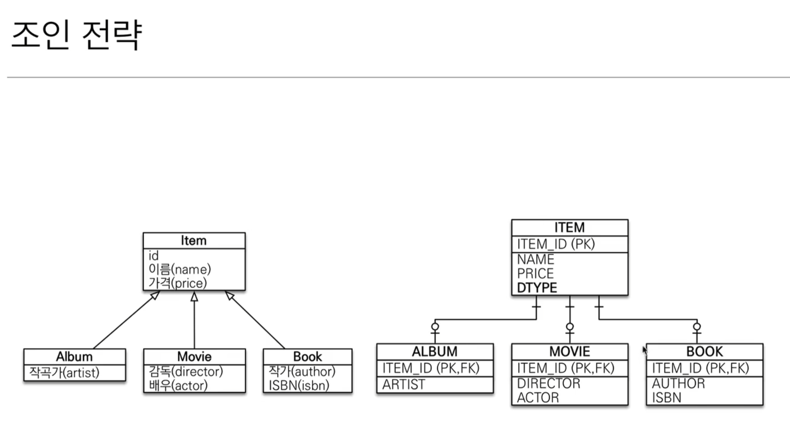
        + 단일 테이블 전략
          + 정의 : 한 테이블에 필드를 선언하고 <U>**DTYPE**</U> 구분한다. (자식 엔티티의 필드를 부모 엔티티에 병합.)
          + 장점 : 
            + 조인이 필요없으므로 일반적으로 조회 성능이 빠름
            + 조회 쿼리가 단순함
          + 단점 : 
            + 자식 엔티티가 매핑한 컬럼은 모두 null 허용 (데이터 무결성 입장에선 애매하다.)
            + 단일 테이블에 모든 것을 저장하므로 테이블이 커질 수 있으므로  
              상황에 따라서 조회 성능이 오히려 느려질 수 있다.
          + 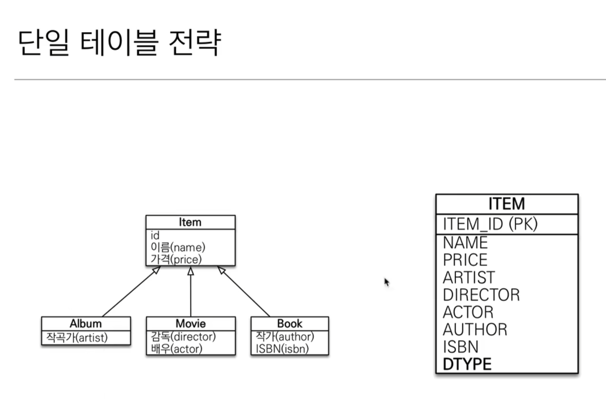
        + 구현 클래스 마다 테이블 전략
          + 정의 : 이 전략은 데이터베이스 설계자와 ORM 전문가 둘다 추천 X
          + 장점 : 
            + 서브 타입을 명확하게 구분해서 처리할 때 효과적
            + not null 제약조건 사용 가능
          + 단점 :
            + 여러 자식 테이블을 함께 조회할 때 성능이 느림 (UNION SELECT)
            + 자식 테이블을 통합해서 쿼리하기 어려움
          + 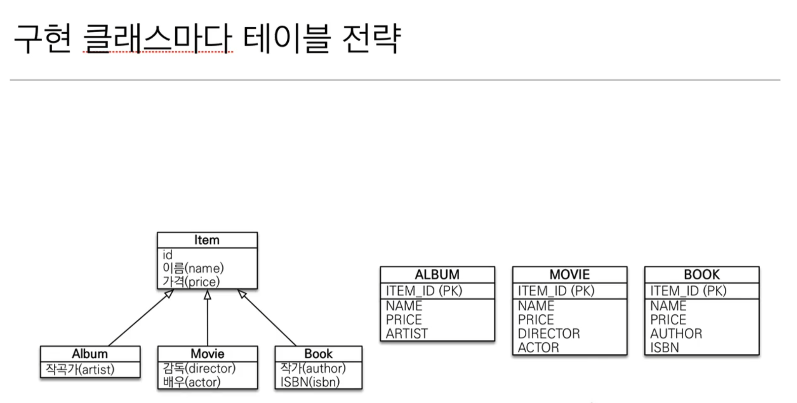
    
    + ### @MappedSuperclass
      + 정의 : 
        + 공통 매핑 정보가 필요할 때 사용[ex) id, name]
        + 상속관계 매핑 X
        + 엔티티 X
        + 테이블과 매핑 X
        + 부모 클래스를 상속 받는 자식 클래스에 매핑 정보만 제공
        + 조회, 검색 불가 [<U>**em.find(MappedSuperClassBaseEntity.class)**</U> 불가]
        + 직접 생성해서 사용할 일이 없으므로 <U>**추상 클래스 권장**</U>
        + 테이블과 관계 없고, 단순히 엔티티가 공통으로 사용하는 매핑 정보를 모으는 역할
        + 주로 등록일, 수정일, 등록자, 수정자 같은 전체 엔티티에서 공통으로 적용하는 정보를 모을 때 사용
        + 참고 : 
          + @Entity 클래스는 엔티티나 @MappedSuperclass로 지정한 클래스만 상속 가능

    + ### 프록시
      + 기초 : 
        + em.find() : 데이터베이스를 통해서 실제 인티티 객체 조회
        + em.getReference() : 데이터베이스 조회를 미루는 가짜(프록시) 엔티티 객체 조회
        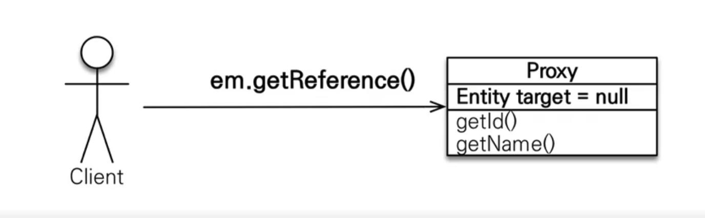
      + 특징 : 
        + 실제 클래스를 상속받아서 만들어짐
        + 실제 클래스와 겉 모양이 같아 사용하는 입장에서는 진짜 객체인지 프록시 객체인지 구분하지 않고 사용하면 됨(이론상)
        + 프록시 객체는 실제 객채의 참조(target)를 보관
        + 프록시 객체를 호출하면 프록시 객체는 실제 객체의 메소드 호출
        + 프록시 객체는 처음 사용할 때 한 번만 초기화
        + 프록시 객체를 초기화 할 때, <U>**프록시 객체가 실제 엔티티로 바뀌는 것이 아니라, 초기화되면 프록시 객체를 통해서 실제 엔티티에 접근 가능**</U>
        + 프록시 객체는 원본 엔티티를 상속 받음, 따라서 타입 체크시 주의해야함 (<U>**== 비교대신 instance of 사용**</U>)
        + <U>**영속성 컨텍스트에 찾는 엔티티가 이미 있으면 em.getReference()를 호출해도 실제 엔티티 반환**</U>
        + 영속성 컨텍스트의 도움을 받을 수 없는 준영속 상태일 때, 프록시를 초기화 문제 발생  
          (하이버네이트는 org.hibernate.LazyInitiallizationException 예외를 터트림)
        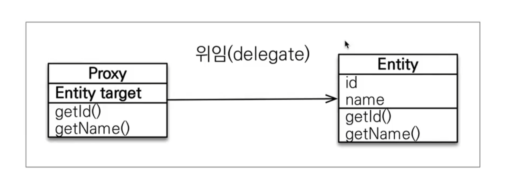
      + 초기화 : 
        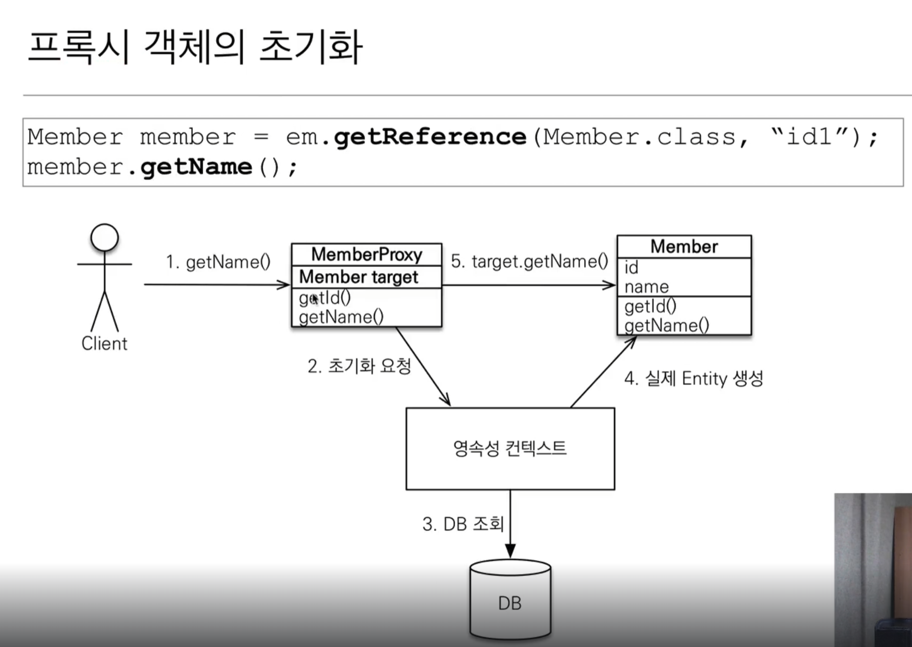
      + 프록시 확인
        + 프록시 인스턴스의 초기화 여부 확인
          + PersistenceUnitUtil.isLoaded(Object entity);
        + 프록시 클래스 확인 방법
          + entity.getClass().getName() 출력
        + 프록시 강제 초기화 (Hibernate)
          + org.hibernate.Hibernate.initialize(entity);
          + <U>**참고 : JPA 강제 초기화 없음**</U>
            + 강제 호출 : <U>**entity.getXXX()**</U> 
    + ### Lazy 로딩(지연 로딩)
      + 연관관계로 맺어진 Member, team 2개의 Entity에서 <U>**fetch = FetchType.LAZY**</U> 로 설정했을 때는  
        Member 엔티티에서 <U>**Team 엔티티를 조회할 때**</U> team은 조회되지 않고 프록시만 생성된다.
      + 그리고 실제 team의 필드를 조회할 때 프록시가 초기화가 되며 SQL쿼리가 실행된다.
    + ### Eager 로딩(즉시 로딩)
      + 연관관계로 맺어진 Member, team 2개의 Entity에서 <U>**fetch = FetchType.EAGER**</U> 로 설정했을 때는  
        Member 엔티티에서 <U>**Team 엔티티를 조회할 때**</U> team도 같이 조회된다.
    + ### 프록시와 즉시로딩 주의
      + <U>**가급적 지연 로딩만 사용(특히 실무에서)**</U>
      + 즉시 로딩을 적용하면 예상하지 못한 SQL이 발생
      + <U>**즉시 로딩은 JPQL에서 N+1 문제를 일으킨다.**</U>
        + <U>**지연로딩을 쓴다고 N+1이 해결되는게 아니다. fetch join을 써야한다.**</U>
      + <U>**@ManyToOne, @OneToOne은 기본이 즉시 로딩이어서 LAZY로딩으로 꼭 설정이 필요하다.**</U>
      + @OneToMany, @ManyToMany는 기본이 지연 로딩 이다.
      
    + ### CASCADE (영속성 전이)
      + 특정 엔티티를 영속 상태로 만들 때 연관된 엔티티도 함께 영속 상태로 만들고 싶을 때
      + 예) 부모 엔티티를 저장할 때 자식 엔티티도 함께 저장
      + 주의 : 
        + CASCADE를 매핑한 두 엔티티의 라이프 사이클이 일치할 때만 쓴다.
        + 영속성 전이는 연관관계를 매핑하는 것과 아무 관련이 없음.
        + 엔티티를 영속화할 때 연관된 엔티티도 함께 영속화하는 편리함을 제공할 뿐이다.
      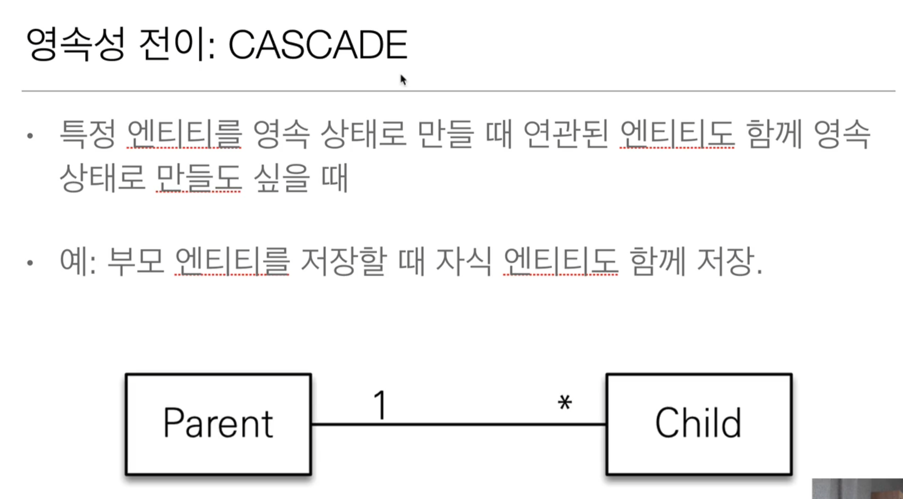
    
    + ### 고아 객체
      + 고아 객체 제거 : 부모 엔티티와 연관관계가 끊어진 자식 엔티티를 자동으로 삭제
      + <U>**orphanRemoval = true**</U>
      + CasCadeParent findParent = em.find(CasCadeParent.class, parent.getId());
        findParent.getChilds().remove(0); -> 자식 엔티티를 컬렉션에서 제거
      + DELETE FROM CASCADECHILD WHERE ID = ? -> 이런식으로 쿼리가 나감
      + 주의 : 
        + 참조가 제거된 엔티티는 다른 곳에서 참조하지 않는 고아 객체로 보고 삭제하는 기능
        + <U>**참조하는 곳이 하나일 때 사용해야함!**</U>
        + <U>**특정 엔티티가 개인 소유할 때 사용**</U>
        + @OneToOne, @OneToMany만 가능.
      + 참고 :
        + 개념적으로 부모를 제거하면 자식은 고아가 된다, 따라서 고아 객체 제거 기능을 활성화 하면, 부모를 제거할 때 자식도 함께 제거된다.  
          이것은 Cascade.Type.REMOVE처럼 동작한다.
      + 영속성 전이 + 고아객체, 생명주기
        + <U>**CascadeType.ALL + orphanRomovel=true**</U>
        + 스스로 생명주기를 관리하는 엔티티는 em.persist()로 영속화, em.remove()로 제거
        + 두 옵션을 모두 활성화 하면 부모 엔티티를 통해서 자식의 생명주기를 관리할 수 있음.
        + 도메인 주도 설계(DDD)의 Aggregate Root개념을 구현할 때 유용 
    + ### JPA의 데이터 타입 분류
      + 엔티티 타입
        + @Entity로 정의하는 객체
        + 데이터가 변해도 식별자로 지속해서 추적 가능
        + 예) 회원 엔티티의 키나 나이값을 변경해도 식별자로 인식 가능
      + 값 타입
        + 인스턴스가 달라도 그 안에 값이 같으면 같은 것으로 봐야함.
        + int, Integer, String 처럼 단순히 값으로 사용하는 자바 기본 타입이나 객체
        + 식별자가 없고 값만 있으므로 변경시 추적 불가
        + <U>**값 타입은 불변 객체(immutable object)로 설계해야함.**</U>
          + -> <U>**setter 사용 금지!!!!**</U>
        + 예) 숫자 100을 200으로 변경하면 완전히 다른 값으로 대체
        + 값 타입 비교 :
          + 동일성(identity) 비교 : 인스턴스의 참조 값을 비교, == 사용
          + 동등성(equivalence) 비교 : 인스턴스의 값을 비교, equals()
          + 값 타입은 a.equals(b)를 사용해서 동등성 비교를 해야함
          + 값 타입의 equals() 메소드를 적절하게 재정의(주로 모든 필드 사용)
        + 값 타입 종류 : 
          + 기본 값 타입 : 
            + 생명주기를 엔티티에 의존
              + 예) 회원을 삭제하면 이름, 나이 필드도 함께 삭제
            + <U>**값 타입은 공유하면 안된다.**</U>
              + 예) 회원 이름 변경시 다른 회원의 이름도 함께 변경되면 안됨
              + 기본 값 타입 종류
            + 자바 기본 타입 :
              + int
              + double
            + 래퍼 클래스
              + 설명 : <U>**하단의 특수한 클래스는 공유 가능한 객체이지만 변경하면 안된다.**</U>
                + String
                + Integer
                + Long
        + 임베디드 타입(embedded type, 복합 값 타입)
          + 설명 : 
            + 새로운 값 타입을 직접 정의할 수 있음
            + JPA는 임베디드 타입 이라함
            + 주로 기본 값 타입을 모아서 만들어서 복합 값 타입이라고도 함
            + int String과 같은 값 타입
            + 임베디드 타입은 엔티티으 값일 뿐이다.
            + <U>**임베디드 타입을 사용하기 전과 후에 매핑하는 테이블은 같다.**</U>
            + 객체와 테이블을 아주 세밀하게 매핑하는 것이 가능
            + 잘 설계한 ORM 애플리케이션은 매핑한 테이블의 수보다 클래스의 수가 더 많음
          + 장점 : 
            + 재사용
            + 높은 응집도
            + EmbeddedPeriod.isWork()처럼 해당 값 타입만 사용하는 의미 있는 메소드를 만들 수 있음
            + 임베디드 타입을 포함한 모든 값 타입은, 값 타입을 소유한 엔티티에 생명주기를 의존함.
          + 단점 : 
            + 임베디드 타입을 여러 엔티티에서 공유하면 위험함.
            + <U>**값이 수정되면 임베디드 받고있는 모든 엔티티가 수정이 된다.**</U>
              + -> 해결 방법 : 대신 값(인스턴스)을 복사해서 새로운 값(new Instance)을 사용
                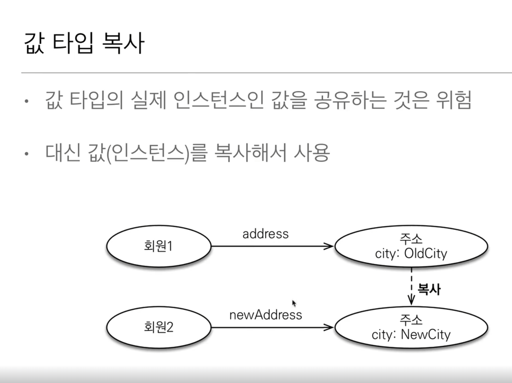
          + 객체 타입의 한계 : 
            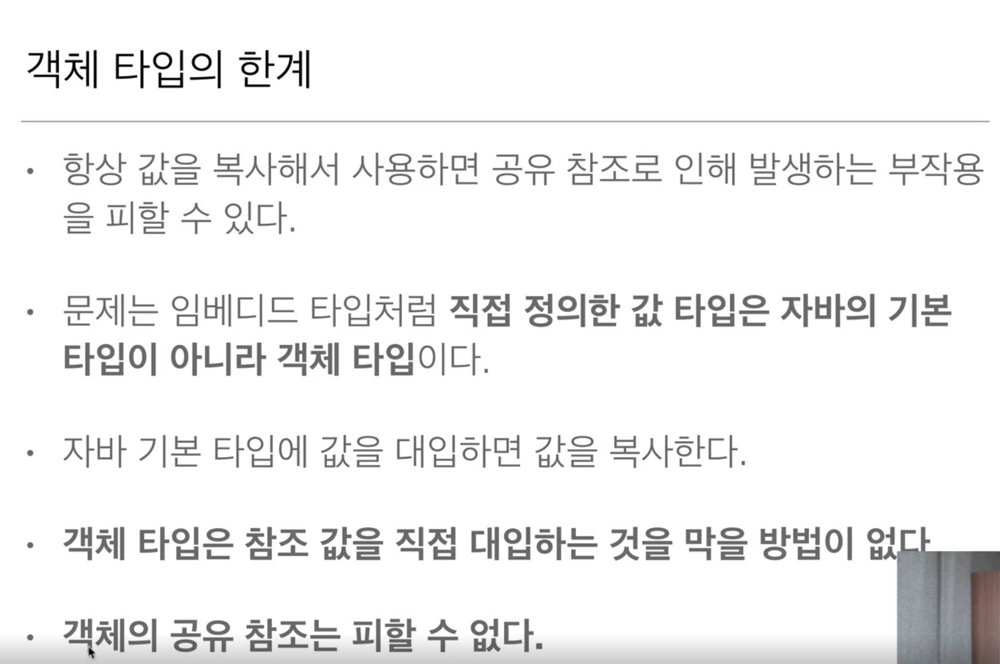
          + 기타 : 
            + 같은 임베디드 타입을 구분해서 쓰고싶을 때는 <U>**@AttributeOverrides**</U> 사용!
              + <U>**EmbeddedMember.java 의 homeAddress, workAddress 참조**</U>
              + name : Embedded로 선언된 클래스의 변수명
              + column : 엔티티에 어떤 컬럼으로 선언할 지 custom
        + 컬렉션 값 타입(collection value type)   
        + ### 값 타입 컬렉션
          + 값 타입을 하나 이상 저장할 때 사용
          + @ElementCollection, @CollectionTable 사용
          + 필드가 1개일 시 @Column을 지정할 수 있다
          + 데이터베이스는 컬렉션을 같은 테이블에 저장할 수 없다.
          + DB는 컬렉션을 저장할 수 없기 때문에 별도의 테이블을 만들어 1:N 관계로 풀어서 컬렉션을 저장해야 한다.
          + <U>**영속성 전이(Cascade) + 고아객체 제거 기능을 필수로 가진다.**</U>
          + DB 조회시 지연로딩을 조회된다 (LAZY)
          + <U>**set방식으로 수정 불가능 (값 타입은 immutable이다.)**</U>
          + 값 타입은 수정시 새로운 인스턴스를 생성해야 한다 (new 객체)
          + ### 값 타입 컬렉션 제약사항
              + 값 타입은 엔티티와 다르게 식별자 개념이 없다.
              + 값은 변경하면 추적이 어렵다.
              + 값 타입 컬렉션에 변경 사항이 발생하면, 주인 엔티티와 연관된 모든 데이터를 삭제하고,
                값 타입 컬렉션에 있는 현재 값을 모두 다시 저장한다.
              + 값 타입 컬렉션을 매핑하는 테이블은 모든 컬럼을 묶어서 기본 키를 구성해야함
                (null 입력 X, 중복 저장 X)
          + ### 값 타입 컬렉션 대안
              + 실무에서는 상황에 따라 값 타입 컬렉션 대신에 1:N 관계를 고려
              + 1:N 관계를 위한 엔티티를 만들고, 여기에서 값 타입을 사용
              + 영속성 전이(Cascade) + 고아 객체 제거를 사용해서 값 타입 컬렉션 처럼 사용
              + 예제) AddressEntity.class
          + ### 엔티티 타입의 특징
              + 식별자 O
              + 생명 주기 관리
              + 공유
          + ### 값 타입의 특징
              + 식별자 X
              + 생명 주기를 엔티티에 의존
              + 공유하지 않는 것이 안전(복사해서 사용)
              + 불변 객체로 만드는 것이 안전
    + ### JPA의 다양한 쿼리 방법
      + JPQL
        + 가장 단순한 조회 방법
          + EntityManager.find()
          + 객체 그래프 탐색[a.getB().getC()]
        + JPA를 사용하면 엔티티 객체를 중심으로 개발
        + 문제는 검색 쿼리
        + 검색을 할 때도 테이블이 아닌 엔티티 객체를 대상으로 검색
        + 모든 DB 데이터를 객체로 변환해서 검색하는 것은 불가능
        + 애플리케이션이 필요한 데이터만 DB에서 불러오려면 결국 검색 조건이 포함된 SQL이 필요
      + JPA Criteria
      + QueryDSL
      + 네이티브 SQL
      + JDBC API 직접 사용, Mybatis, SpringJdbcTemplate 함께 사용

    + ### 기본 문법과 쿼리 API
      + 문법 :
          + ex) "select m from JpqlMember m where m.age > 18"
          + 엔티티와 속성은 대소문자 구분해야 한다.(JpqlMember, age)
          + JPQL 키워드는 대소문자 구분을 하지 않아도 된다.(SELECT, FROM, where)
          + 엔티티 이름 사용, 테이블 이름이 아님(Member)
          + 별칭은 필수(m) (as는 생략 가능)
          + TypeQuery, Query
              + TypeQuery : 반환 타입이 명확할 때 사용
                  + ex)
              + Query : 반환 타입이 명확하지 않을 때 사용
          + 결과조회 API
              + query.getResultList() : 결과가 하나 이상일 때, 리스트 반환
                  + 결과가 없으면 빈 리스트 반환
              + query.getSingleResult() : 결과가 정확히 하나, 단일 객체 반환 (null 허용 안됌)
                  + 결과가 없으면 : NoResultException
                  + 결과가 2개 이상이면 : NonUniqueResultException
          + 파라미터 바인딩 - 이름기준, 위치기준
              + 이름 기준 :
                  + 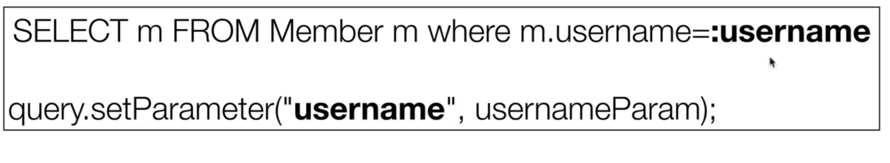
              + 순서 기준 :
                  + 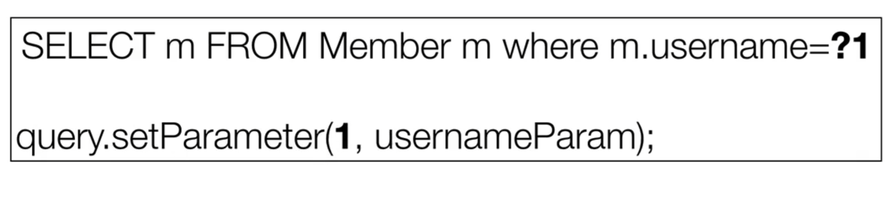
    
    + ### 프로젝션(SELECT)
      + SELECT 절에 조회할 대상을 지정하는 것
      + 프로젝션 대상 : 엔티티, 임베디드 타입, 스칼락 타입(숫자, 문자 등 기본 데이터 타입)
      + 엔티티 프로젝션 -> SELECT m from JpqlMember m
      + 엔티티 프로젝션 -> SELECT m.team JpqlMember m
      + 임베디드 타입 프로젝션 -> SELECT m.address FROM JpqlMember m
      + 스칼라 타입 프로젝션 : SELECT m.username, m.age FROM JpqlMember m
      + DISTINCT로 중복 제거
      + 여러 값 조회
        + SELECT m.username, m.age FROM JpalMember m
          1. Query 타입으로 조회
          2. Object[] 타입으로 조회
          3. new 명령어로 조회
            + 단순 값을 DTO로 바로 조회
            + ex) select new kr.co.kjc.study.jpastudy.jpql.dto.JpqlMemberDto(m.username, m.age) from JpqlMember m where m.username = :username
            + 패키지 명을 포함한 전체 클래스 명 입력
            + 순서와 타입이 일치하는 생성자 필요
          
    + ### 페이징
      + setFirstResult : 조회 시작 위치 (0부터 시작)
      + setMaxResults : 조회할 데이터 수
      
    + ### 조인
      + 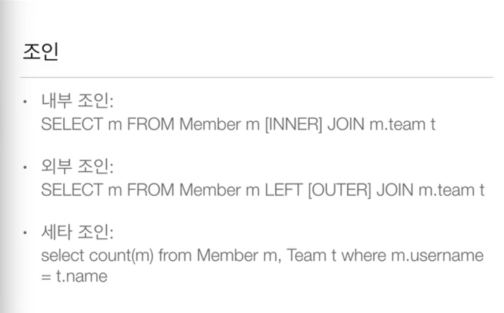
      
    + ### 서브 쿼리
      + 함수 : 
        + EXISTS : 서브쿼리에 결과가 존재하면 참
          + ALL : 모두 만족하면 참
          + ANY, SOME : 같은의미, 조건을 하나라도 만족하면 참
        + IN : 서브쿼리의 결과중 하나라도 같은 것이 있으면 참\
      + 한계 : 
        + JPA는 WHERE, HAVING 절에서만 서브 쿼리 가능
        + SELECT 절도 가능(하이버네이트에서 지원)
        + <U>**FROM 절의 서브 쿼리는 현재 JPQL에서 불가능**</U>
          + <U>**조인으로 풀 수 있으면 풀어서 해결**</U>
    + ### JPQL 타입 표현
      + 문자 : 'HELLO', 'She"s'
      + 숫자 : 10L(Long), 10D(Double), 10F(float)
      + Boolean : TRUE, FALSE
      + ENUM : kr.co.kjc.study.jpastudy.jpql.enums.JpqlMemberType
      + 엔티티 타입 : TYPE(m) = Member (상속관계에서 사용)
      